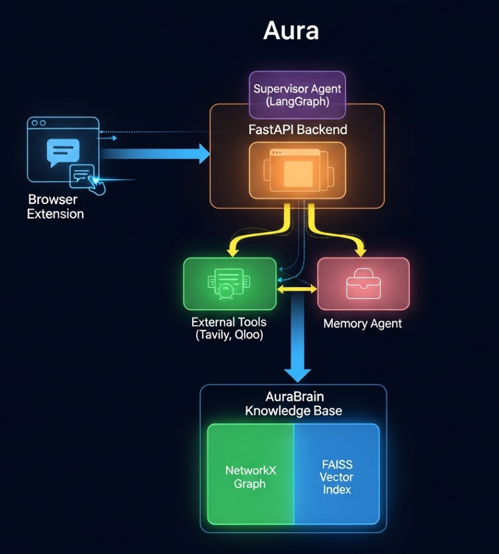

# Aura
Aura: Your Personal AI Assistant
Aura is a proactive, multi-agent AI assistant that builds a "Living Knowledge Graph" of your digital life. It's a prototype for a new class of personal AI that understands your context, learns from your interactions, and acts as a true extension of your mind.

## Inspiration
The inspiration for Aura began with a fascination with the evolution of technology and a deep-seated goal to make the digital world more accessible. The project started with the observation that AI is following the same path as the personal computer, moving from large, centralized systems to deeply personal, decentralized ones.

This technical vision found its true purpose in a mission to solve the digital accessibility crisis. Sparked by an early internship developing a text-to-speech chatbot to assist patients with visual and motor disabilities, the ultimate goal of Aura is to create an AI that adapts technology to human needs, empowering people with disabilities and older adults to navigate the digital world with dignity and independence.

## What it does
Aura is a proactive AI assistant that acts as an intelligent partner for your digital life. Its primary interface is a chat window within its browser extension. You can go to any website, open Aura, and instantly start a conversation about the content on that page. Aura reads the site's information and combines it with its deep, personal knowledge of your preferences, goals, and history to provide uniquely insightful answers that a generic chatbot never could.

Beyond contextual chat, Aura builds a "Living Knowledge Graph" of your world. With every conversation and every piece of information you effortlessly save with a right-click, the graph grows richer and more interconnected. This means Aura isn't static; it evolves with you. Over time, it develops a nuanced understanding of who you are, allowing it to provide proactive suggestions and personalized insights that become more helpful and insightful with every interaction.

## How It's Built
Aura is built on a modern, multi-agent architecture designed for robust and intelligent operation.

Orchestration: The system is conducted by a Supervisor agent built with LangGraph. This supervisor analyzes user requests, creates multi-step plans, and delegates tasks to specialized tools.

Knowledge Base: The "brain" is a hybrid knowledge base running locally. NetworkX is used to store the explicit, factual graph of nodes and relationships in a file, and FAISS (HNSW) provides a super-fast, dynamic vector index for semantic search.

AI & APIs: The core of the project is the Qloo API, used as the primary tool for cultural enrichment. The supervisor also uses OpenAI's GPT-4o-mini for reasoning and planning, and is equipped with a Tavily Search tool for real-time web access.

Backend & Frontend: A FastAPI server exposes the supervisor, which is accessed by a Chrome Extension built with HTML, CSS, and JavaScript that features both a chat popup and a right-click context menu.

## Setup and Installation
Follow these steps to get Aura running on your local machine.

1. Prerequisites:

Python 3.10+

A modern web browser that supports extensions (e.g., Google Chrome)

API Keys for:

OpenAI

Tavily AI

Qloo (for the Hackathon)

2. Backend Setup:

Bash

# Clone the repository to your local machine
git clone <your-repo-url>
cd Aura_Project/backend

# Create and activate a Python virtual environment
python -m venv venv
source venv/bin/activate  # On Windows, use `venv\Scripts\activate`

# Install the required Python dependencies
pip install -r requirements.txt

# Set up your API keys
# It is recommended to set these as system environment variables.
# For example, on Windows:
# setx OPENAI_API_KEY "your_openai_key"
# setx TAVILY_API_KEY "your_tavily_key"
# setx QLOO_API_KEY "your_qloo_key"
# (You will need to restart your terminal after setting them)

# Run the backend server
uvicorn main:app --reload
Your backend should now be running at http://127.0.0.1:8000.

3. Frontend Setup (Chrome Extension):

Open Google Chrome and navigate to the extensions page: chrome://extensions.

Enable "Developer mode" using the toggle in the top-right corner.

Click the "Load unpacked" button that appears.

In the file selection dialog, navigate to and select the Aura_Project/extension folder.

The "Aura Assistant" extension should now appear in your list of extensions and in your browser's toolbar.

## Challenges Ran Into
The biggest challenge was architecting the knowledge base. After exploring simpler options, I realized that to achieve a truly "living" graph, a hybrid NetworkX + FAISS model was needed to handle both semantic meaning and factual connections. Another significant hurdle was prompt engineering for the LangGraph supervisor. The planner agent would often generate malformed plans, which was solved through several iterations of making the instructions more explicit. Finally, correctly implementing the two-step Qloo API workflow required careful logic to handle all edge cases.

## What's next for Aura
The ultimate vision for Aura is to be an indispensable partner for navigating both your inner and outer worlds. The next steps are:

Passive Data Ingestion: Evolve beyond the right-click capture to a system that can passively and privately learn from Browse history to build the knowledge graph automatically.

Deeper Integrations: Connect directly with other personal data sources like Spotify, Google Calendar, or email to create an even richer and more holistic understanding of the user.

Enhanced Agentic Actions: Give the supervisor more tools, allowing Aura to not just recommend, but to act on the user's behalf—like creating a new playlist based on a Qloo recommendation or adding a suggested event to your calendar.